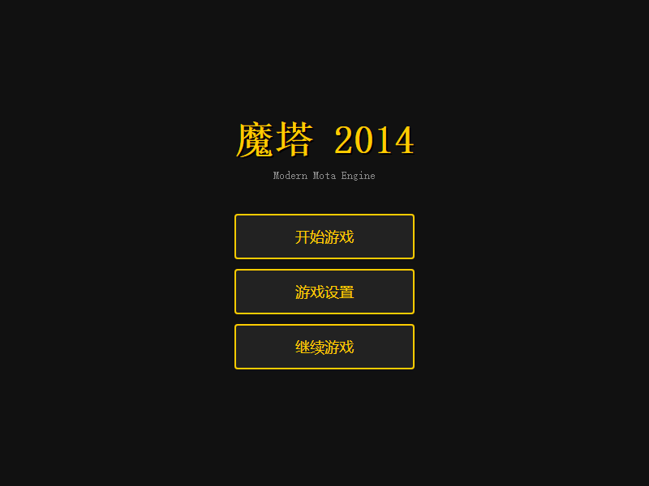
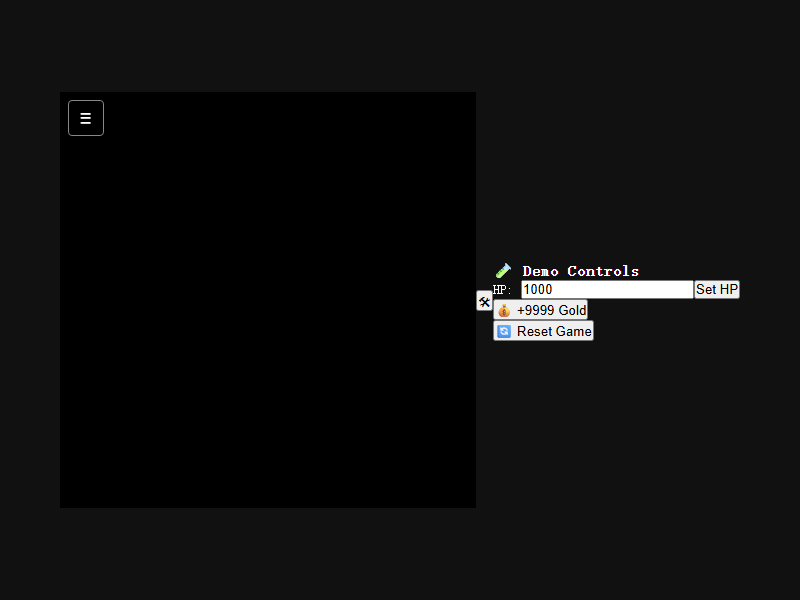
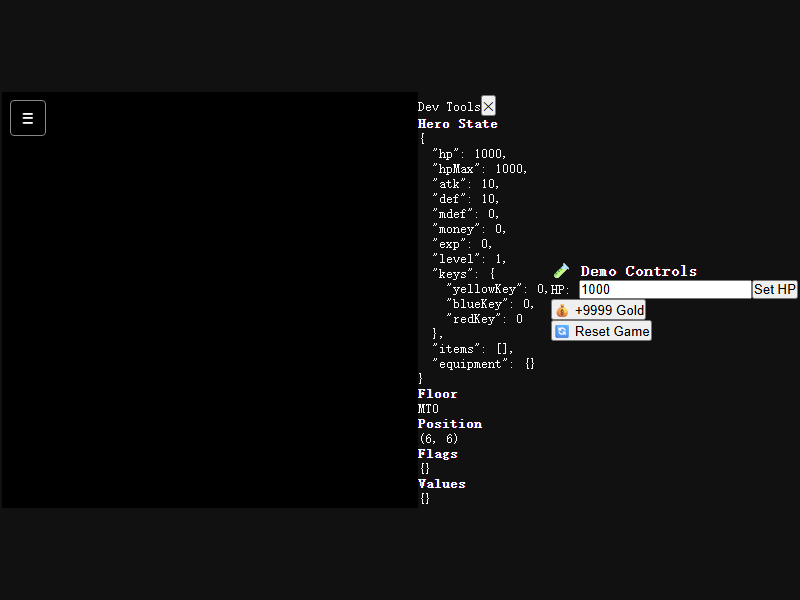
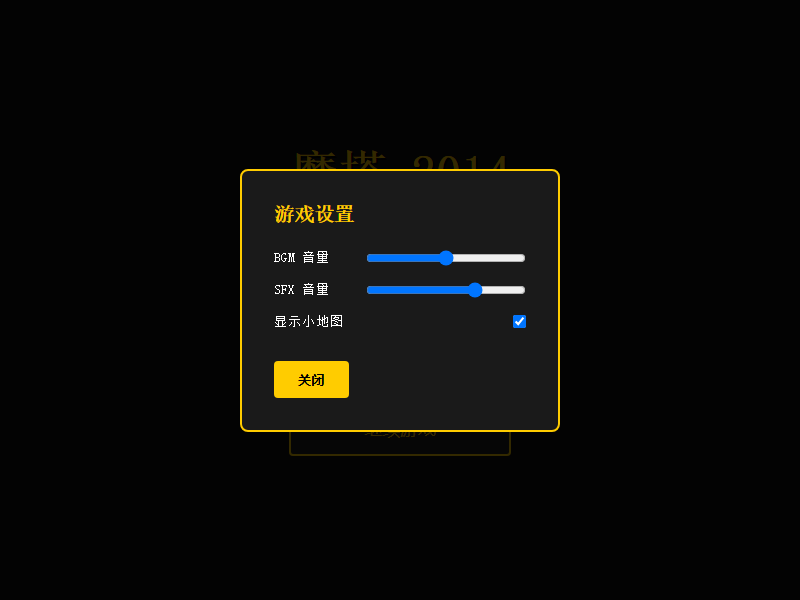

# Modern Mota — 演示

> 生成时间：2026-08-08
> 引擎版本：0.1.0

---

## 截图概览

### 1. 主菜单



**功能：**
- 游戏标题「魔塔 2014」
- 副标题「Modern Mota Engine」
- 三个按钮：开始游戏、游戏设置、继续游戏

---

### 2. 游戏画布



**技术特性：**
- Phaser 3 游戏引擎渲染（416×416 像素，13×13 瓦片网格）
- TileMap 层渲染
- 角色精灵系统
- DOM UI 层覆盖（HP 条、楼层名称、消息框）
- 摄像机跟随
- 键盘输入（WASD / 方向键）

---

### 3. DevTools 开发面板



**功能：**
- 实时 Hero 状态（HP/ATK/DEF/Money/Level/Items）
- 当前楼层 ID
- 位置坐标
- Flags（游戏事件标记）
- Values（自定义数值变量）

---

### 4. 设置弹窗



**功能：**
- BGM 音量调节
- SFX 音量调节
- 小地图开关
- 实时预览

---

## 性能数据

| 指标 | 数值 |
|---|---|
| 构建产物大小 | 1,713 kB（含 Phaser 3 引擎） |
| CSS 产物 | 1.57 kB |
| TypeScript 类型检查 | 0 错误 ✅ |
| 测试覆盖 | 55 个测试全绿 ✅ |
| Dev Server 启动 | ~420ms |
| Production Preview | http://localhost:4173 |

---

## 技术栈亮点

- **游戏引擎**：Phaser 3（Canvas/WebGL 双渲染后端）
- **状态管理**：Zustand + Immer（不可变状态）
- **数据验证**：Zod Schema（TypeScript 推断）
- **表达式求值**：AST Parser（jsep，无 `eval`）
- **事件机**：Generator-based（可暂停/恢复）
- **寻路**：A* 算法
- **包管理**：pnpm 9 monorepo

---

## 运行截图的脚本

```bash
# 1. 启动 preview 服务器
pnpm preview

# 2. 运行截图脚本（新终端）
node scripts/screenshot.mjs
```

截图将保存到 `docs/screenshots/` 目录。
